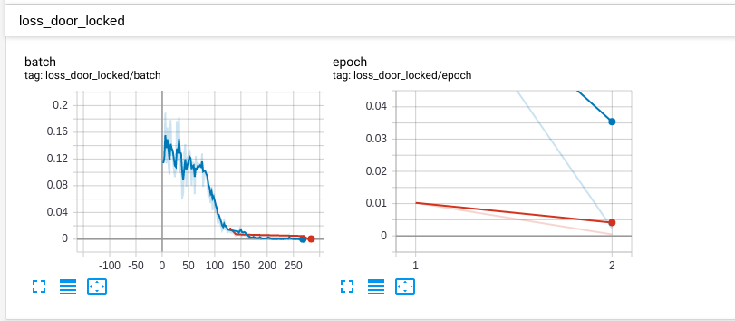
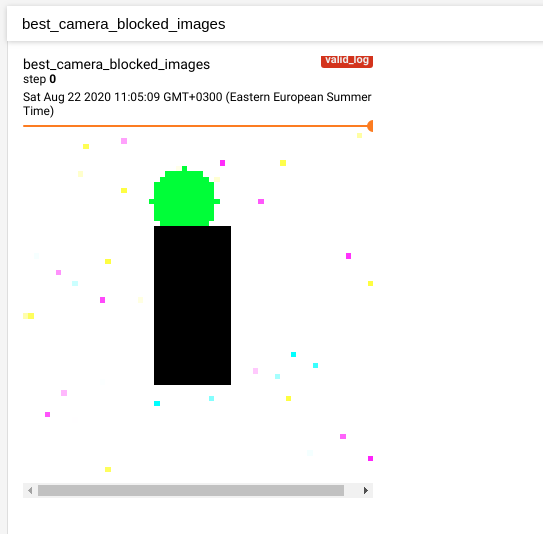

## `dnn_cool`: Deep Neural Networks for Conditional objective oriented learning

To install, just do:

```bash
pip install dnn_cool
```

* [Introduction](#introduction): What is `dnn_cool` in a nutshell?
* [Examples](#examples): a simple step-by-step example.
* [Features](#features): a list of the utilities that `dnn_cool` provides for you
* [Customization](#customization): Learn how to add new tasks, modify them, etc.
* [Inspiration](#inspiration): list of papers and videos which inspired this library

To see the predefined tasks for this release, see [list of predefined tasks](#list-of-predefined-tasks)

### Introduction

A framework for multi-task learning in Pytorch, where you may precondition tasks and compose them into bigger tasks.
Many complex neural networks can be trivially implemented with `dnn_cool`.
For example, creating a neural network that does classification and localization is as simple as:

```python
@project.add_flow
def localize_flow(flow, x, out):
    out += flow.obj_exists(x.features)
    out += flow.obj_x(x.features) | out.obj_exists
    out += flow.obj_y(x.features) | out.obj_exists
    out += flow.obj_w(x.features) | out.obj_exists
    out += flow.obj_h(x.features) | out.obj_exists
    out += flow.obj_class(x.features) | out.obj_exists
    return out
```

If for example you want to classify first if the camera is blocked and then do localization **given that the camera 
is not blocked**, you could do:

```python
@project.add_flow
def full_flow(flow, x, out):
    out += flow.camera_blocked(x.cam_features)
    out += flow.localize_flow(x.localization_features) | (~out.camera_blocked)
    return out
```

Based on these "task flows" as we call them, `dnn_cool` provides a bunch of [features](#features).
Currently, this is the list of the predefined tasks (they are all located in `dnn_cool.task_flow`):

##### List of predefined tasks

In the current release (0.1.0), the following tasks are availble out of the box:

* `BinaryClassificationTask` - sigmoid activation, thresholding decoder, binary cross entropy loss function. In the 
examples above, `camera_blocked` and `obj_exists` are `BinaryClassificationTask`s.
* `ClassificationTask` - softmax activation, sorting classes decoder, categorical cross entropy loss. In the example 
above, `obj_class` is a `ClassificationTask`
* `MultilabelClassificationTask` - sigmoid activation, thresholding decoder, binary cross entropy loss function.
* `BoundedRegressionTask` - sigmoid activation, rescaling decoder, mean squared error loss function. In the examples 
above, `obj_x`, `obj_y`, `obj_w`, `obj_h` are bounded regression tasks.
* `TaskFlow` - a composite task, that contains a list of children tasks. We saw 2 task flows above. 

### Examples

#### Quick Imagenet example

We just have to add a `ClassificationTask` named `classifier` and add the flow below:

```python
@project.add_flow()
def imagenet_model(flow, x, out):
    out += flow.classifier(x.features)
    return out
```

That's great! But what if there is not an object always? Then we have to first check if an object exists. Let's
add a `BinaryClassificationTask` and use it as a precondition to classifier.

```python
@project.add_flow()
def imagenet_model(flow, x, out):
    out += flow.object_exists(x.features)
    out += flow.classifier(x.features) | out.object_exists
    return out
```

But what if we also want to localize the object? Then we have to add new tasks that regress the bounding box. Let's 
call them `object_x`, `object_y`, `object_w`, `object_h` and make them a `BoundedRegressionTask`. To avoid 
preconditioning all tasks on `object_exists`, let's group them first. Then we modify the 
flow:

```python
@project.add_flow()
def object_flow(flow, x, out):
    out += flow.classifier(x.features)
    out += flow.object_x(x.features)
    out += flow.object_y(x.features)
    out += flow.object_w(x.features)
    out += flow.object_h(x.features)
    return out 

@project.add_flow()
def imagenet_flow(flow, x, out):
    out += flow.object_exists(x.features)
    out += flow.object_flow(x.features) | out.object_exists
    return out
```

But what if the camera is blocked? Then there is no need to do anything, so let's create a new flow
that executes our `imagenet_flow` only when the camera is not blocked.

```python
def full_flow(flow, x, out):
    out += flow.camera_blocked(x.features)
    out += flow.imagenet_flow(x.features) | (~out.camera_blocked)
    return out
```

But what if for example we want to check if the object is a kite, and if it is, to classify its color?
Then we would have to modify our `object_flow` as follows:

```python
@project.add_flow()
def object_flow(flow, x, out):
    out += flow.classifier(x.features)
    out += flow.object_x(x.features)
    out += flow.object_y(x.features)
    out += flow.object_w(x.features)
    out += flow.object_h(x.features)
    out += flow.is_kite(x.features)
    out += flow.color(x.features) | out.is_kite
    return out 
```

I think you can see what `dnn_cool` is meant to do! :)

To see a full walkthrough on a synthetic dataset, check out the [Colab notebook](https://colab.research.google.com/drive/1fEidcOszTI9JXptbuU5GGC-O_yxb6hxO?usp=sharing)
or the [markdown write-up](./story.md).

### Features

Main features are:

* [Task precondition](#task-preconditioning)
* [Missing values handling](#missing-values)
* [Task composition](#task-composition)
* [Tensorboard metrics logging](#tensorboard-logging)
* [Task interpretations](#task-interpretation)
* [Task evaluation](#task-evaluation)
* [Task threshold tuning](#task-threshold-tuning)
* [Dataset generation](#dataset-generation)
* [Tree explanations](#tree-explanations)

##### Task preconditioning

Use the `|` for task preconditioning (think of `P(A|B)` notation). Preconditioning - ` A | B` means that:

* Include the ground truth for `B` in the input batch when training
* When training, update the weights of the `A` only when `B` is satisfied in the ground truth.
* When training, compute the loss function for `A` only when `B` is satisfied in the ground truth
* When training, compute the metrics for `A` only when `B` is satisfied in the ground truth.
* When tuning threshold for `A`, optimize only on values for which `B` is satisfied in the ground truth.
* When doing inference, compute the metrics for `A` only when the precondition is satisfied according to the decoded
result of the `B` task
* When generating tree explanation in inference mode, do not show the branch for `A` if `B` is not 
satisfied.
* When computing results interpretation, include only loss terms when the precondition is satisfied.

Usually, you have to keep track of all this stuff manually, which makes adding new preconditions very difficult. 
`dnn_cool` makes this stuff easy, so that you can chain a long list of preconditions without worrying you forgot 
something.

##### Missing values

Sometimes for an input you don't have labels for all tasks. With `dnn_cool`, you can just mark the missing label and
`dnn_cool` will update only the weights of the tasks for which labels are available. 

This feature has the awesome property that you don't need a single dataset with all tasks labeled, you can
have different datasets for different tasks and it will work. For example, you can train a single object detection 
neural network that trains its classifier head on ImageNet, and its detection head on COCO.

##### Task composition

You can group tasks in a task flow (we already saw 2 above - `localize_flow` and `full_flow`). You can use this to
organize things better, for example when you want to precondition a whole task flow. For example:

```python
@project.add_flow
def face_regression(flow, x, out):
    out += flow.face_x1(x.face_localization)
    out += flow.face_y1(x.face_localization)
    out += flow.face_w(x.face_localization)
    out += flow.face_h(x.face_localization)
    out += flow.facial_characteristics(x.features)
    return out
```

##### Tensorboard logging

`dnn_cool` logs the metrics per task in Tensorboard, e.g:



##### Task interpretation

Also, the best and worst inputs per task are logged in the Tensorboard, for example if the input is an image:

 

##### Task evaluation

Per-task evaluation information is available, to pinpoint the exact problem in your network. An example
evaluation dataframe:

|    | task_path                                                | metric_name         |   metric_res |   num_samples |
|---:|:---------------------------------------------------------|:--------------------|-------------:|--------------:|
|  0 | camera_blocked                                           | accuracy            |   0.980326   |           996 |
|  1 | camera_blocked                                           | f1_score            |   0.974368   |           996 |
|  2 | camera_blocked                                           | precision           |   0.946635   |           996 |
|  3 | camera_blocked                                           | recall              |   0.960107   |           996 |
|  4 | door_open                                                | accuracy            |   0.921215   |           902 |
|  5 | door_open                                                | f1_score            |   0.966859   |           902 |
|  6 | door_open                                                | precision           |   0.976749   |           902 |
|  7 | door_open                                                | recall              |   0.939038   |           902 |
|  8 | door_locked                                              | accuracy            |   0.983039   |           201 |
|  9 | door_locked                                              | f1_score            |   0.948372   |           201 |
| 10 | door_locked                                              | precision           |   0.982583   |           201 |
| 11 | door_locked                                              | recall              |   0.934788   |           201 |
| 12 | person_present                                           | accuracy            |   0.999166   |           701 |
| 13 | person_present                                           | f1_score            |   0.937541   |           701 |
| 14 | person_present                                           | precision           |   0.927337   |           701 |
| 15 | person_present                                           | recall              |   0.963428   |           701 |
| 16 | person_regression.face_regression.face_x1                | mean_absolute_error |   0.0137292  |           611 |
| 17 | person_regression.face_regression.face_y1                | mean_absolute_error |   0.0232761  |           611 |
| 18 | person_regression.face_regression.face_w                 | mean_absolute_error |   0.00740503 |           611 |
| 19 | person_regression.face_regression.face_h                 | mean_absolute_error |   0.0101     |           611 |
| 20 | person_regression.face_regression.facial_characteristics | accuracy            |   0.932624   |           611 |
| 21 | person_regression.body_regression.body_x1                | mean_absolute_error |   0.00830785 |           611 |
| 22 | person_regression.body_regression.body_y1                | mean_absolute_error |   0.0151234  |           611 |
| 23 | person_regression.body_regression.body_w                 | mean_absolute_error |   0.0130214  |           611 |
| 24 | person_regression.body_regression.body_h                 | mean_absolute_error |   0.0101     |           611 |
| 25 | person_regression.body_regression.shirt_type             | accuracy_1          |   0.979934   |           611 |
| 26 | person_regression.body_regression.shirt_type             | accuracy_3          |   0.993334   |           611 |
| 27 | person_regression.body_regression.shirt_type             | accuracy_5          |   0.990526   |           611 |
| 28 | person_regression.body_regression.shirt_type             | f1_score            |   0.928516   |           611 |
| 29 | person_regression.body_regression.shirt_type             | precision           |   0.959826   |           611 |
| 30 | person_regression.body_regression.shirt_type             | recall              |   0.968146   |           611 |

##### Task threshold tuning

Many tasks need to tune their threshold. Just call `flow.get_decoder().tune()` and you will get optimized thresholds
for the metric you define.

##### Dataset generation

As noted above, `dnn_cool` will automatically trace the tasks used as a precondition and include the ground truth for 
them under the key `gt`.

##### Tree explanations

Examples:

```
├── inp 1
│   └── camera_blocked | decoded: [False], activated: [0.], logits: [-117.757324]
│       └── door_open | decoded: [ True], activated: [1.], logits: [41.11258]
│           └── person_present | decoded: [ True], activated: [1.], logits: [60.38873]
│               └── person_regression
│                   ├── body_regression
│                   │   ├── body_h | decoded: [29.672623], activated: [0.46363473], logits: [-0.14571853]
│                   │   ├── body_w | decoded: [12.86382], activated: [0.20099719], logits: [-1.3800735]
│                   │   ├── body_x1 | decoded: [21.34288], activated: [0.3334825], logits: [-0.69247603]
│                   │   ├── body_y1 | decoded: [18.468979], activated: [0.2885778], logits: [-0.9023013]
│                   │   └── shirt_type | decoded: [6 1 0 4 2 5 3], activated: [4.1331367e-23 3.5493638e-17 3.1328378e-26 5.6903808e-30 2.4471377e-25
 2.8071076e-29 1.0000000e+00], logits: [-20.549513  -6.88627  -27.734364 -36.34787  -25.6788   -34.751904
  30.990908]
│                   └── face_regression
│                       ├── face_h | decoded: [11.265154], activated: [0.17601803], logits: [-1.5435623]
│                       ├── face_w | decoded: [12.225838], activated: [0.19102871], logits: [-1.4433397]
│                       ├── face_x1 | decoded: [21.98834], activated: [0.34356782], logits: [-0.64743483]
│                       ├── face_y1 | decoded: [3.2855165], activated: [0.0513362], logits: [-2.9166584]
│                       └── facial_characteristics | decoded: [ True False  True], activated: [9.9999940e-01 1.2074912e-12 9.9999833e-01], logits: [ 14.240071 -27.442476  13.27557 ]

```

but if the model thinks the camera is blocked, then the explanation would be:

```
├── inp 2
│   └── camera_blocked | decoded: [ True], activated: [1.], logits: [76.367676]
```

### Customization

Since `flow.torch()` returns a normal `nn.Module`, you can use any library you are used to. If you use 
[Catalyst](https://github.com/catalyst-team/catalyst), `dnn_cool` provides a bunch of useful callbacks. Creating
a new task is as simple as creating a new instance of this dataclass:

```python
@dataclass
class Task(ITask):
    name: str
    labels: Any
    loss: nn.Module
    per_sample_loss: nn.Module
    available_func: Callable
    inputs: Any
    activation: Optional[nn.Module]
    decoder: Decoder
    module: nn.Module
    metrics: Tuple[str, TorchMetric]
```

Alternatively, you can subclass `ITask` and implement its inferface.

### Inspiration

* [Andrej Karpathy: Tesla Autopilot and Multi-Task Learning for Perception and Prediction](https://www.youtube.com/watch?v=IHH47nZ7FZU)
* [PyTorch at Tesla - Andrej Karpathy, Tesla](https://www.youtube.com/watch?v=oBklltKXtDE)
* [Multitask learning - Andrew Ng](https://www.youtube.com/watch?v=UdXfsAr4Gjw)
